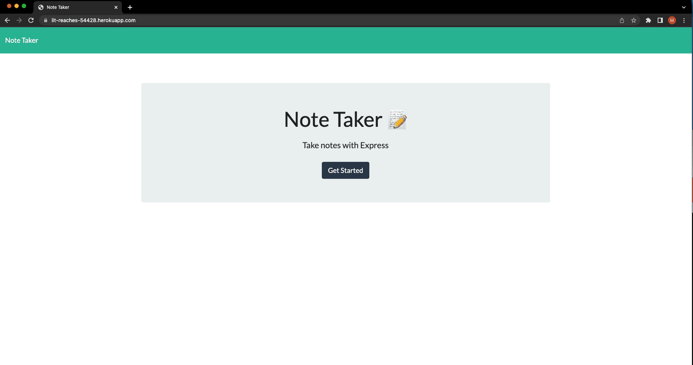
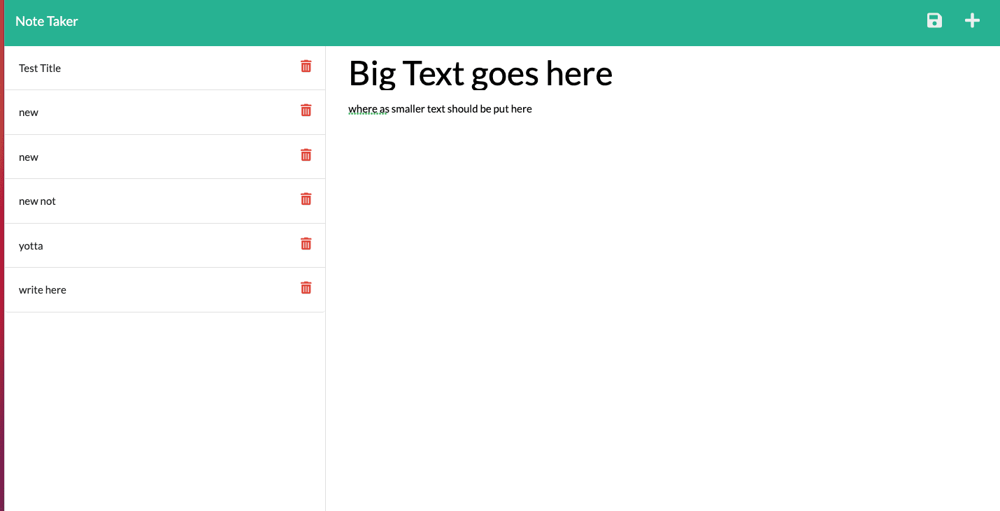

# Duly Noted

## Description  
This application enables users create and save notes through on a web page. Notes created are saved to a JSON database using Express.js. Saved notes are displayed in the application and can be recalled for dispplay.

## Table of Contents
* [Usage](#usage)
* [Screenshots](#screenshots)

## Usage
To use Duly_Noted, navigate to the deployed application found here: https://lit-reaches-54428.herokuapp.com/ and note duly.

## Screenshots

